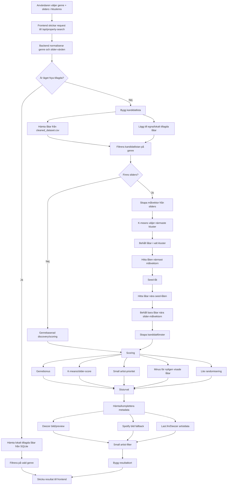
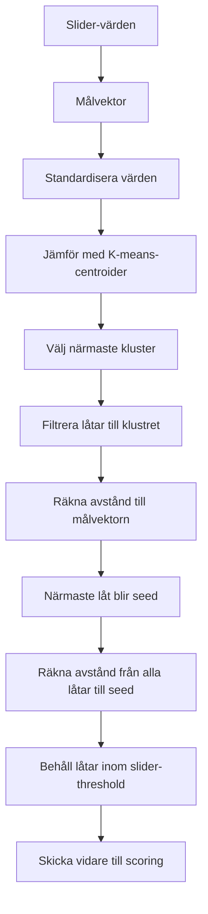

# Discovery Flow Diagrams

## Discovery/Musikmix

## K-means/Seed Logic

## One Sentence Summary

K-means väljer musikaliskt område, seed-låten ger en konkret referenspunkt, och scoring/small-artist-filtret avgör vad som faktiskt visas.
